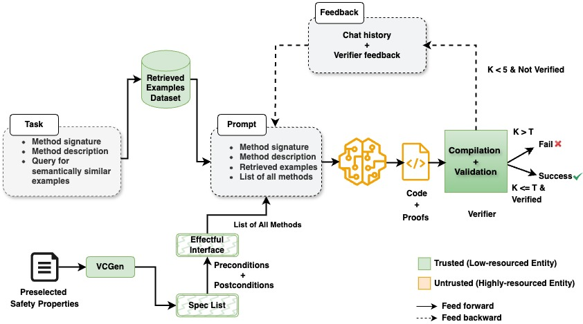

# Proof Carrying Code Completions (PC<sup>3</sup>)
[](https://opensource.org/licenses/MIT)

PC<sup>3</sup>: A Dafny framework for generating code together with a proof of a safety property.

> [!WARNING]
> PC<sup>3</sup> is under active development.

# Table of Contents

1. [Introduction](#introduction)
2. [Installation](#installation)
3. [Configuration](#configuration)
4. [Usage](#usage)
5. [Repository Structure](#repositoryStructure)
6. [Contributors](#contributors)
7. [Contributing](#contributing)
8. [License](#license)


# Introduction
PC<sup>3</sup> (proof carrying code completions) is a Dafny framework for generating code together with a proof of a safety property selected by the user.
PC<sup>3</sup>  is a research prototype; it has the following current limitations:

- Currently, PC<sup>3</sup> supports code generation (i.e., full function bodies) and support for code completions is work-in-progress.
- The safety properties are chosen and converted to verification conditions manually in the current version.


# Installation
## Clone PC<sup>3</sup> Repository
1. Clone PC<sup>3</sup> repository using this link `https://github.com/DavisPL/PCCC.git`
## Dependencies
### Install Dafny
1. Use [Dafny official user installation instruction](https://github.com/dafny-lang/dafny/wiki/INSTALL) to install Dafny ``version 4.6.0`` on a unix-based system.
2. Make sure that dafny is accessible from the command line and verify the version by trying `dafny --version`. The output should be <b>=4.6.0</b>
### Install Python
1. Use [python](https://docs.python.org/3/contents.html) official documentation to install a python with ``version >=3.12.3``.
2. Check python version `python --version`. The output should be <b>>=3.12.3</b>
---

### Requirements
Use the package manager [pip](https://pip.pypa.io/en/stable/) to install requiremetns.

Create a virtual environment using `python -m venv /path/to/new/virtual/environment` for instance: `python3 -m venv pccc-venv`
Activate the virtual environment using `source pccc-venv/bin/activate` for a unix-based system and `pccc-venv\Scripts\activate.bat` for a windows-based system. In case of having any issue or requiring more details please refer to [python documentation on the creation of virtual environments](https://docs.python.org/3/library/venv.html)

To install required packages you can simply use the following command
```
pip install -r requirements.txt
```
Or install required packages separately using pip
```
pip install openai
pip install anthropic
pip install langchain
pip install langchain-anthropic
pip install langchain-community
pip install langchain-core
pip install langchain-openai
pip install langchain-text-splitters
pip install langsmith
pip install lunary
```
---
# Configuration
Use the [config.yaml](./config.yaml) file and modify it to add your desired configurations to work with PCCC.
Config file includes four main parts that should be modified to set the requirements for the tool execution and the configurations required for the few-shot prompting.
1. API keys: the API keys for the required autoregressive transformer model and also Lunary API for logging the input to the model and the model's response.
      If you only would like to use openAI models you need to add openai_api_key and also set the model
    ```
        # OpenAI API KEY
        openai_api_key = your-api-key
        # LLM to be used 'gpt-4'
        model = gpt-4
    ```
    If you would like to switch to another model, simply remove the openai_api_key and add the new_api_key for another model.

> [!NOTE]
> Currently, our tool only supports openAI and Claude.
> Adding the lunary_api_key is optional. If you use Lunary for logging the prompt and the model's response you need to add it to as below:
```
    # Lunary API KEY
    lunary_api_key = YOUR_API_KEY
```
2. Model parameters: LLM parameters including the LLM model, coold down time, temperature (= 0.75), max number of tokens (= 4000).
    For this part you only need to modify the model name. However, you can also modify the temperature and other model parameters.
    ```
    MODEL:
    # LLM to be used 'gpt-4'
    model: gpt-4
    # Model temperature
    temp: 0.75
    # Number of attempts/samples
    K_run: 5
    # top_p (0,1) default: 1
    top_p: 1
    # Adjustable number of tokens to control response length
    max_tokens: 4000
    # Number of completions to generate
    n: 1
    # Stop completion tokens
    stop: null
    # Waiting time
    cool_down_time: 3
    ```
3. Environment: Set the absolute path for the following files:
        - Set the absolute path for the input task [task 6 json file](./src/tasks/task-6.json)
        - Set the absolute path for the output [output](./output/)
        - Set the absolute path for the effectful interface APIs to allow the tool to include it in the generated code [effectful interface](./filesystems-api/interface/effectful-interface.dfy)
        ```
        # REQUIRED FILES
        [ENVIRONMENT]
        # Filesystems task JSON path (absolute path)
        task_path = path_to_task_6_json
        # Base output path (absolute path)
        base_output_path = path_to_output
        # Effectful interface API path (absolute path)
        interface_path = path_to_effectful_interface

        ```


4. Few-shot config: Set the absolute path to required files and number of few-shot examples
    - Set RAG examples by adding the absolute path to the [json file including RAG example](./benchmark/RAG_samples.json)
    - Set the absolute path to the [json file that includes APIs of the effectful interface] (./benchmark/interface_api.json)
    - Set the number of few shot examples in the  [Chain of Thought (CoT) Prompt template]()  5 in our exper
    ```
    # Required for dynamic Few-Shot RAG Prompting
    # example CWEs JSON path (absolute path)
    RAG_json_path = path_to_RAG_samples_json
    # Filesystem API reference path (absolute path)
    api_reference_path = path_to_effectful_interface_api_json
    # number of code examples in [Chain of Thought (CoT) Prompt]
    code_shot_count = 5
    ```

# Usage
1. Switch to the [source folder](./src/) and run the [main.py](./src/main.py) file to run the tool
```
cd src
python3 main.py
```

2. The output files are available in [output directory](./src/output)
    - files with verification_log suffix shows the status of the generated code at each try
        - If the generated code is verified the output is
        ```
            Dafny program verifier finished with 1 verified, 0 errors
        ```
        - If the generated code cannot be verified with Dafny compiler the output shows the line of code that caused the error:
        ```
                |
             10 |    requires has_valid_path_length(directory + filename);
                |    ^

                1 parse errors detected in task_id_6-gpt-4-temp_0.75-k_1.dfy
        ```
    - Generated dafny codes for each attempt are saved in the files with .dfy extension.
    - For each attempt a json file includes the config, total number of errors, the few shot example ids, the generated code, and the model response with a template like the following one:
    ```
    {"id": "6", "K": 2, "temperature": 0.75, "task_id": "6", "task_description": "Your task is to implement a function which takes the filename as a parameter, which will then be used to create a full file path in a predetermined directory ( e.g.,'/home/user/documents').", "model": "gpt-4", "dafny_code": "method CreateFullPath(filename: seq<char>) returns (fullpath: seq<char>)\n requires is_valid_file_name(filename)\n requires !has_dangerous_pattern(filename)\n requires has_valid_file_length(filename)\n {\n   var directory: seq<char> := \"/home/user/documents\";\n   fullpath := Join(directory, filename);\n }", "isVerified": true, "code_example_shots": "5", "code_response": "Follow these steps to complete the task:\n\n\nStep 1: Analyze and select the required APIs and their preconditions from the list of API reference.\nFor this task:\n - method Join(p: path, f: file) returns(result: path)\n requires non_empty_string(f)\n requires non_empty_string(p)\n requires !has_dangerous_pattern(f)\n requires !has_dangerous_pattern(p)\n requires has_absolute_path(f)\n requires is_valid_file_name(f)\n requires is_valid_path_name(p)\n requires has_valid_file_length(f)\n requires has_valid_path_length(p)\n requires has_valid_path_length(p+f)\n\nStep 2:  Implement the Dafny code for the described task, adhering to the provided structure for each API. Utilize the provided API list and their specifications.\nProvide the implementation in Dafny syntax as follows:\n\n```dafny\ninclude \"/Users/pari/pcc-llms/filesystems-api/interface/effectful-interface.dfy\"\n\nmethod CreateFullPath(filename: seq<char>) returns (fullpath: seq<char>)\n requires is_valid_file_name(filename)\n requires !has_dangerous_pattern(filename)\n requires has_valid_file_length(filename)\n {\n   var directory: seq<char> := \"/home/user/documents\";\n   fullpath := Join(directory, filename);\n }\n```\nThe method `CreateFullPath` takes a filename as its parameter and appends it to the directory path \"/home/user/documents\" to create a full path. The filename must be a valid file name, have a valid file length and should not contain any dangerous pattern.", "code_examples_ids": ["4", "1", "3", "5", "2"], "total_no_errors": 0}
    ```
    - A json file includes the output of last attempt that is similar to the output described above.


# Repository Structure
Most of the source code of PC<sup>3</sup> can be found in `src/.` The prompt template can be found in `src/prompts_template/` and the example in our paper is task-6 that can be found in `src/tasks/task-6.json`. The few-shot examples can be found in `benchmark/RAG_samples`.

# Contributors

This repository is maintained actively by:
- **Parnian Kamran**: [pkamran@ucdavis.edu]

> [!NOTE]
> Some parts of our implementation, including some of the LangChain infrastructure and prompt template generation, reuse code from the dafny-synthesis tool. Please check [that repository](https://github.com/Mondego/dafny-synthesis) for further information.

If you have any issues please contact us:
- **Parnian Kamran**: [pkamran@ucdavis.edu]
- **Caleb Stanford**: [cdstanford@ucdavis.edu]

# Contributing

We welcome any contributions to this repository. Please follow the instructions in the installation to start working with PC<sup>3</sup>.

## How to Contribute

1. Fork the repository.
2. Create a new branch for your feature or bugfix.
3. Make your changes.
4. Submit a pull request with a detailed description of your changes.

## Citing the repository

If you would like to cite this repository, please cite our publication.
```
Parnian Kamran, Premkumar Devanbu, and Caleb Stanford. 2024. Vision Paper: Proof-Carrying Code Completions. In 39th IEEE/ACM International Conference on Automated Software Engineering Workshops (ASEW ’24), Octo- ber 27-November 1, 2024, Sacramento, CA, USA. ACM, New York, NY, USA, 7 pages. https://doi.org/10.1145/3691621.3694932
```
[Paper Link](https://web.cs.ucdavis.edu/~cdstanford/doc/2024/ASEW24b.pdf)

Alternatively, you may cite this repository directly:

Proof-Carrying Code Completions. Parnian Kamran, Premkumar Devanbu, Caleb Stanford. GitHub repository (2024)[GitHub Link](https://github.com/DavisPL/PCCC.git)


# License

This repository is licensed under an [MIT license](https://github.com/DavisPL/PCCC/blob/main/LICENSE). The parts of this software that are reused from [dafny-synthesis](https://github.com/Mondego/dafny-synthesis) are licensed under the GNU General Public License v3.0.
